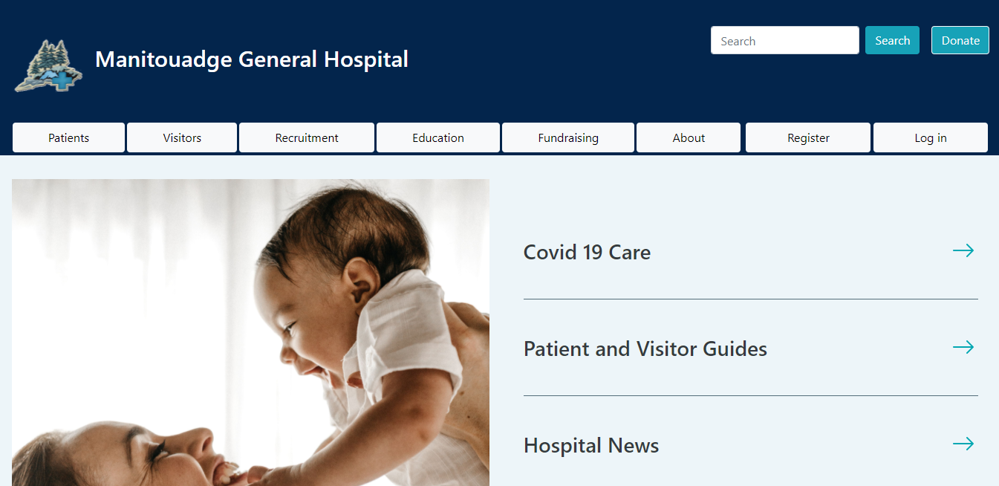

<!--
*** Thanks for checking out the Best-README-Template. If you have a suggestion
*** that would make this better, please fork the repo and create a pull request
*** or simply open an issue with the tag "enhancement".
*** Thanks again! Now go create something AMAZING! :D
***
***
***
*** To avoid retyping too much info. Do a search and replace for the following:
*** ntrpi, Manitouage1, twitter_handle, email, HTTP5204 Hospital Project, A proposed redesign of the Manitouage Hospital website.
-->


<!-- PROJECT SHIELDS -->
<!--
*** I'm using markdown "reference style" links for readability.
*** Reference links are enclosed in brackets [ ] instead of parentheses ( ).
*** See the bottom of this document for the declaration of the reference variables
*** for contributors-url, forks-url, etc. This is an optional, concise syntax you may use.
*** https://www.markdownguide.org/basic-syntax/#reference-style-links
-->

<!-- PROJECT LOGO -->
<br />
<p align="center">
  <a href="https://github.com/ntrpi/Manitouage1">
    
  </a>

  <h3 align="center">HTTP5204 Hospital Project</h3>

  <p align="center">
    A proposed redesign of the Manitouadge General Hospital website.
    <br />
    <br />
    <a href="https://github.com/ntrpi/Manitouage1">View Demo</a>
    ·
    <a href="https://github.com/ntrpi/Manitouage1/issues">Report Bug</a>
    ·
    <a href="https://github.com/ntrpi/Manitouage1/issues">Request Feature</a>
  </p>
</p>

<!-- TABLE OF CONTENTS -->
<details open="open">
  <summary><h2 style="display: inline-block">Table of Contents</h2></summary>
  <ol>
    <li>
      <a href="#about-the-project">About the Project</a>
      <ul>
        <li><a href="#built-with">Built With</a></li>
      </ul>
    </li>
    <li>
      <a href="#getting-started">Getting Started</a>
      <ul>
        <li><a href="#software">Software</a></li>
        <li><a href="#installation">Installation</a></li>
        <li><a href="#running-the-application">Running the Application</a></li>
      </ul>
    </li>
    <li><a href="#features">Features</a>
      <ul>
        <li><a href="#alerts">Alerts</a></li>
        <li><a href="#events">Events</a></li>
        <li><a href="#donations-feature">Donations</a></li>
        <li><a href="#department-feature">Departments</a></li>
        <li><a href="#job-posting-feature">Job Postings</a></li>
        <li><a href="#invoices">Invoices</a></li>
      </ul>
    </li>
    <li><a href="#contributing">Contributions</a>
          <ul>
        <li><a href="#amanda">Amanda</a></li>
            <ul>
            <li><a href="#features-1">Features</a></li>
            <li><a href="#team-work">Team Work</a></li>
            </ul>
        <li><a href="#farshan">Farshan</a></li>
            <ul>
            <li><a href="#features-2">Features</a></li>
            <li><a href="#team-work-1">Team Work</a></li>
            </ul>
        <li><a href="#kyle">Kyle</a></li>
            <ul>
            <li><a href="#features-3">Features</a></li>
            <li><a href="#team-work-2">Team Work</a></li>
            </ul>
        <li><a href="#miho">Miho</a></li>
            <ul>
            <li><a href="#features-4">Features</a></li>
            <li><a href="#team-work-3">Team Work</a></li>
            </ul>
        <li><a href="#sandra">Sandra</a>
          <ul>
            <li><a href="#project">Project</a></li>
            <li><a href="#features-5">Features</a></li>
            <li><a href="#front-end">Front End</a></li>
            <li><a href="#documentation">Documentation</a></li>
            <li><a href="#team-work-4">Team Work</a></li>
          </ul>
        </li>
        <li><a href="#wafa">Wafa</a></li>
            <ul>
            <li><a href="#features-6">Features</a></li>
            <li><a href="#team-work-5">Team Work</a></li>
            </ul>
      </ul>
    </li>
    <li><a href="#contact">Contact</a></li>
    <li><a href="#acknowledgements">Acknowledgements</a></li>
  </ol>
</details>

<!-- ABOUT THE PROJECT -->
## About The Project

This project is the culmination of the work we have put into several of our classes in the second semester of the Humber Web Development program. The goal is to showcase our ability to envision, plan, and implement a large-scale project with real-world application. Our team was tasked with evaluating the existing website for the Manitouadge General Hospital, taking inventory of the content, and reimagining it as a web application that could be used to enhance communication and health management for the Manitouadge community. This involved a thorough reconstruction of the information architecture, as well as exploring and evaluating new content and features that would be compatible with the goals of the hospital, in addition to developing a completely new visual design.

What you will find in this repository are the first steps towards making our vision a reality. The duration of a single semester did not allow for us to fully complete the implementation of our design, but does showcase our general skills and abilities and allows the user to accurately imagine what the final result could be.

### Built With

* [Visual Studio Community 2019](https://visualstudio.microsoft.com/vs/community/)

<!-- GETTING STARTED -->
## Getting Started

To get a local copy up and running follow these simple steps.

### Software

Download and install [Visual Studio Community 2019](https://visualstudio.microsoft.com/vs/community/), and make sure you have a working browser. For full functionality, please ensure that JavaScript is enabled.

### Installation

Clone the repo:
  ```sh
  git clone https://github.com/ntrpi/Manitouage1.git
  ```

### Running the Application

1. In a file explorer, navigate to the cloned repository and double-click on Manitouage1.sln. This will open Visual Studio.

2. In the Visual Studio menu bar click Tools > NuGet Package Manger > Package Manger Console.

3. In the Package Manger Console window, enter the following commands:
  ```sh
  enable-migrations
  ```
  ```sh
  add-migration new_migration
  ```
  ```sh
  update-database
  ```

4. In the menu bar click Project > Manitouage1 Properties. In the properties window that opens, click Web in the left side menu. Set the Project Url property to 
  ```sh
  https://localhost:44397/
  ```

5. In the menu bar click Debug > Start Without Debugging, or press Ctrl+F5. The application will open in a new browser window or tab. 

## Features


### Alerts
The Alerts feature will allow users to see upcoming events, job postings and everything that users need to know in regards to health regulations, policies, vaccinations etc. The purpose of this feature is for users to get immediate access to new happenings within the community.

My View model is currently not working and this is something I would like to fix in the next semester, as well as adding admin roles to my code.

### Events
Hospitals are underfunded, especially with the demand from them in this current time. The events feature is a means of fundraising for the hospital and also for donating to certain charities. One thing we noticed is how important community is to the northern Ontario communities. Having events would be a way for the community to come together while also helping the hospital and charities that are in need.

My View model is currently not working and this is something I would like to fix in the next semester, as well as adding admin roles to my code.

### Donations Feature
The donation feature will let users (visitors) send in a donation amount to the hospital. There will be a donation button present on the top right corner of the homepage. It will also be present on the bottom of the homepage to make it easier and quick for the user to navigate to the donations page. Once redirected, the user will be sent to the main donations page where the user will be asked to fill out their general information. This is also where users are able to donate to a an event or just donate towards the hospital. 

I would have liked to implement a captcha feature to validated the user donating once the database in able to hold the data I would also like to add in a paypall API to direct users to a payment page with the values inputted in the donation form fields to create a personalized payment page giving user a feel good experience while donating.

### Department Feature
- The departments feature is directories and provides information about each department.

Visitors to the website will see a link called, “department” under For Medical Professionals section in footer and be able to click on the link and view the department information, such as department neme, categories, phone number as well as extension numbers, email address, and FAX.

The department feature will have an administrative backend that will manage the departments. Administration staff can create, display, update, delete the contents by content management system. Administrative users will have to login to the administrative side of the application and then choose “Department” from the available links on the main dashboard. On the department page, user click one of the lists to editor delete, or if it was the first time to edit the Departments, there is no list so they can create a new department.

The Job posting entity is associated with the Departments entity. These have one to many relationships. department_id in Job posting will be a foreign key to retrieve department name (and other information) for job posting

### Job Posting Feature
- The Job posting feature is that the hospital can announce the job availability and recruit the public on the home page.

Visitors to the website will see the job posting under Recruitment on the main navigation. Each job posting may include the contents such as department information, job title, job description, salary, deadline for the application. Also, from this page, visitors to the website can apply for the job (“Apply for the job” is another feature).
The job posting feature will have an administrative backend that will manage the job posting. Administration staff can create, display, update, delete the contents by content management system. Administrative users will have to login to the administrative side of the application and then choose “Job Posting” from the available links on the main dashboard. On the Job posting page, user clicks one of the lists to edit or delete, or create a new job posting.

### Invoices

In Canada we are lucky to have the amazing, publicly funded health care system that we have. Unfortunately, there are times when a visit to the hospital incurs expenses that are not covered by that system and must be paid by an individual. Some of those expenses are services, like ambulance rides or having a private room. Others can be physical products like post operative braces or supports.

Regardless of the type of expense, it makes sense to have a list of the services and products that have an additional cost. It also makes sense to have the ability to easily create invoices for those services and products, issue the invoices to a recipient, and keep track of whether they have been paid or not. This feature provides that ability.

<!-- CONTRIBUTING -->
## Contributions

### Amanda

#### Features
- Event Model
- Alert Model
- ViewAlert Viewmodel
- ListEventxDonation Viewmodel
- Event Controller/Data Controller
- Alert Controller/Data Controller
- All views for Event
- All views for Alert

#### Team Work
- I met with Christine to debug and work on git/migration issues and informed the team of what I learned so they can apply the same knowledge on 04/07/2021
- Assisted Miho in debugging on 4/8/2021
- Kyle, Miho and I communicated any changes that were made to models and worked together on 04/08/2021
- I have contributed the Alerts and Events models, controllers and views
- Helped Miho debug issues with git
- Worked with Wafa on Event and Donation view model relationships
- Constantly communicated any changes I made to models or in regards to pulling or pushing

### Farshan

#### Features
- Contact us model
- contact us controller

#### Team Work
- Almost deleted wafa's work for good

### Kyle

#### Features
- Testimonial Model
- Volunteer Model
- Testimonial Controllers
- Volunteer Controllers
- Views for all the above controller routes
- Made changes to the AccountController.cs so that new users are automatically added to the "User" grou

#### Team Work
- helped Miho resolve migration issues
- Miho helped me add TinyMCE to my feature


### Miho

#### Features
- Department and Job Posting feature
- Department Model
- Job Posting Model
- Department Controller and Department Data Controller
- Job Posting Controller and Job Posting Data Controller
- Views and ViewModels for Department and Job Posting
- Added Tiny Editor plugin for Textarea for Job Posting Description 
- Styled similar to wireframe

#### Team Work
- Communicate with team members for any changes 

### Sandra

#### Project
- Created project and initialized repo.
- Set up everything so Entity Framework would work.
- Determined a strategy to prevent database conflicts while the models were in constant flux.
- Created a RolesController to help automate the addition of roles to the database.
- Added some database seeding for Roles so that they will be consistent for everyone.

#### Features
- Created a ControllersHelper to reduce errors and create consistency in the interactions between view and data controllers without obscuring access to either of those endpoints.
- Changes to the IdentityModel to be able to access the Users managed by the framework.
- Initial CRUD for Products and Invoices as separate entities.
- Started adding views to manage the relationship between Users and Invoices.
- Added the many-to-many relationship between Products and Invoices.
- Successfully added client-side functionality to dynamically update the invoice view as products are added.
- Got the C part of CRUD working for invoices with AJAX.
- Got the CRD part of CRUD working for invoices with products. Working on U. 

#### Front End
- Recovered the auto-generated nav that disappeared after a bunch of NuGet packages were updated.
- Added some structure and style to the layout.
- Home page content and styling.
- Constructed main and footer navs.

#### Documentation
- Ensured my code was well commented.
- Created readme with sections for everyone to fill out.
- Added links in the readme to the features that have been added.
- Added an image, project description, and Getting Started section to the readme.
- Fixed everyone's links in the readme.
- Added auto-generated XML documentation.

#### Team Work
- Helped Amanda with database issues.
- Helped Amanda with a strange VS/Windows system issue.
- Helped Wafa debug some db and build issues.
- Continual communication with the team about changes to models and front end.
- Helped students from other teams debug their work.
- Helped Amanda correctly structure and show the 1-1 relationship between Alerts and 2 other models.

### Wafa

#### Features
- Donation Model
- Intial CRUD for donations model
- Events Feature Intergration (Amanda's Model)
- Added foreign key in the events table to create one to many relation between events and donations
- Donations ApiController and Donation contorller 
- Basic CRUD views
- ViewModel connecting to Events
- Code commments summarizing functionaily in regular and data controllers 

#### Team Work

- Worked with Amanda with pull and pushing issues
- Constant updates to team when migrations where added
- Communicated with the team about code back ups in case any issues arise
- Communicated with Amanda to create a database model that will hold FK's in Events and Donations model
- Working on view models with Amanda to get combine functionality

<!-- CONTACT -->
## Contact

- Amanda - amanda.elias@live.ca
- Farshan - farshanaslam@gmail.com
- Kyle - Cheung.kyle1@gmail.com
- Miho - mihoko.s0408@gmail.com
- Sandra - kupfer.sandra@gmail.com
- Wafa - wafamustafak@gmail.com


Project Link: [https://github.com/ntrpi/Manitouage1](https://github.com/ntrpi/Manitouage1)


<!-- ACKNOWLEDGEMENTS -->
## Acknowledgements

* [Christine Bittle](https://github.com/christinebittle)
* [Best README Template](https://github.com/othneildrew/Best-README-Template)


<!-- MARKDOWN LINKS & IMAGES -->
<!-- https://www.markdownguide.org/basic-syntax/#reference-style-links -->
[contributors-shield]: https://img.shields.io/github/contributors/ntrpi/repo.svg?style=for-the-badge
[contributors-url]: https://github.com/ntrpi/repo/graphs/contributors
[forks-shield]: https://img.shields.io/github/forks/ntrpi/repo.svg?style=for-the-badge
[forks-url]: https://github.com/ntrpi/repo/network/members
[stars-shield]: https://img.shields.io/github/stars/ntrpi/repo.svg?style=for-the-badge
[stars-url]: https://github.com/ntrpi/repo/stargazers
[issues-shield]: https://img.shields.io/github/issues/ntrpi/repo.svg?style=for-the-badge
[issues-url]: https://github.com/ntrpi/repo/issues
[license-shield]: https://img.shields.io/github/license/ntrpi/repo.svg?style=for-the-badge
[license-url]: https://github.com/ntrpi/repo/blob/master/LICENSE.txt
[linkedin-shield]: https://img.shields.io/badge/-LinkedIn-black.svg?style=for-the-badge&logo=linkedin&colorB=555
[linkedin-url]: https://linkedin.com/in/ntrpi
